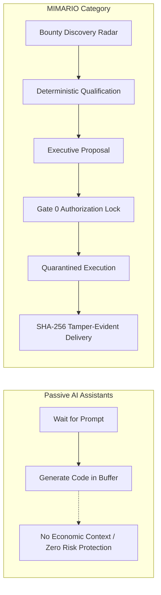
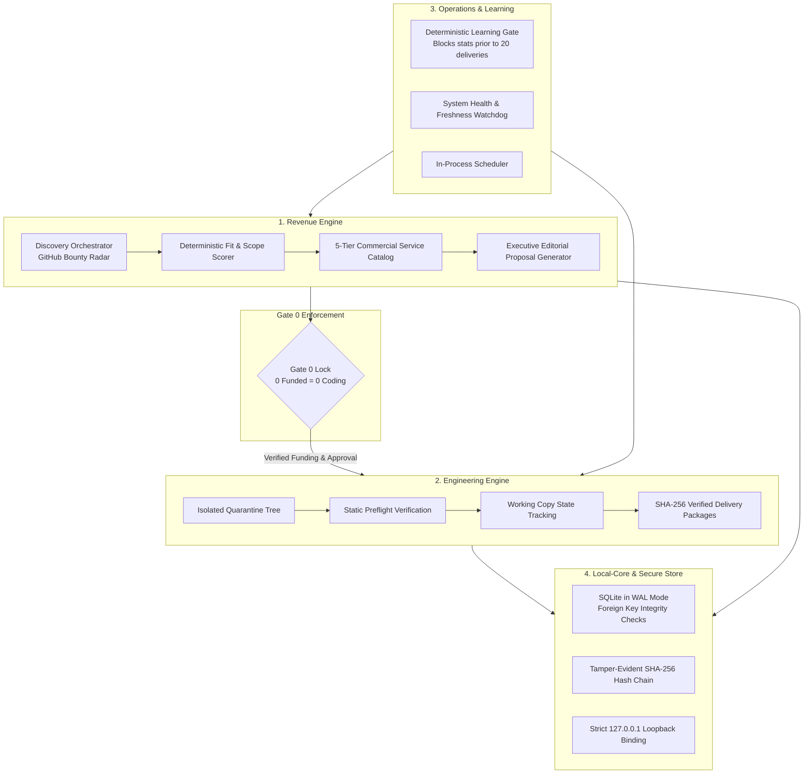

# MIMARIO — The Autonomous Revenue & Engineering Operating System

> **Executive Summary:** MIMARIO is a proprietary, local-first software engineering operating system unifying autonomous commercial opportunity discovery, deterministic qualification, executive proposal generation, quarantined code execution, and tamper-evident delivery receipts.

---

## 1. The Industry Problem & Strategic Opportunity

Modern AI coding assistants (Copilot, Cursor, Windsurf) remain strictly confined to the editor buffer—operating passively and with zero commercial context. Conversely, pure cloud VM agents generate steep monthly infrastructure bills ($500+/seat/mo) while exposing client code to third-party hosted servers.

MIMARIO bridges this divide by providing an end-to-end, local-first system designed to:
1. **Eliminate Speculative Unpaid Work:** Hardware-enforced Gate 0 locks engineering execution until deposit/funding is confirmed.
2. **Eliminate Mandatory Cloud Expenses:** Core runtime, parsing, quarantine, and packaging run locally on host CPU resources ($0.00 infrastructure overhead).
3. **Preserve Code Sovereignty:** Proprietary client files remain strictly on the operator workstation with zero external telemetry leakage.

---

## 2. System Architecture: 4 Decoupled Engines

MIMARIO is engineered as a modular monolith in TypeScript and native Node.js, structured across 4 strictly decoupled core engines:

---

## 3. Gate 0 Invariant: "0 Funded = 0 Coding"

A foundational principle of MIMARIO is the **fail-closed Gate 0 policy**:
* **The Rule:** No automated or operator-directed engineering execution can occur on third-party code before verified funding/escrow authorization.
* **The Mechanism:** The execution daemon rejects working-tree extraction requests unless a cryptographically signed authorization token or confirmed escrow deposit state exists in the SQLite store.
* **The Result:** Eliminates unpaid speculative development, protects developer hours, and prevents contractual disputes.

---

## 4. Standardized 5-Tier Commercial Catalog

MIMARIO maps raw issue specifications into 5 standardized commercial packages with precise scope boundaries:

| Tier | Service Name | Target Price | Scope Description | Typical SLA |
|:---:|---|:---:|---|:---:|
| **1** | **Quick Triage** | $29 — $39 | Defect reproduction, environment validation, patch verification | 1–2 hours |
| **2** | **Repo Diagnostic** | $59 — $89 | Vulnerability scan, dependency health audit, architecture report | 2–4 hours |
| **3** | **Code Rescue** | $149 — $249 | Build error resolution, compatibility patch, unit test suite | 4–8 hours |
| **4** | **Integration Sprint** | $299 — $499 | API connection, backend module implementation, schema migration | 1–2 days |
| **5** | **Advanced Sprint** | $750+ | Subsystem refactoring, performance optimization, security hardening | 2–4 days |

---

## 5. Verified Technical Metrics & Audit Evidence

The software asset has undergone thorough release hardening and compliance auditing:

* **Codebase Scale:** Exactly **55,916 lines of code** across **209 source files** (TypeScript, native Node.js, React 19).
* **Security & Secret Audit:** **594 files scanned**; confirmed **0 exposed secrets, 0 private keys, 0 hardcoded credentials**.
* **License Cleanliness:** Clean open-source footprint (permissive MIT / Apache-2.0 dependencies only; zero viral GPL/AGPL dependencies).
* **Network Isolation:** Binds strictly to `127.0.0.1:43177` (zero public open listeners).
* **Tamper-Evident Event Hash Chain:** 113+ cryptographically chained events consemnated in SQLite WAL mode.
* **Block Certifications:** All 8 functional blocks (Blocks 0 through 7) tested and certified (PASS).

---

## 6. Executive Documents & Acquisition Resources

The following executive materials are available in this repository:

* 📄 **[MIMARIO Executive Pitch Deck (PDF)](./MIMARIO_EXECUTIVE_PITCH_DECK.pdf)** — 9-slide widescreen acquisition brief.
* 📄 **[Product & Technical Architecture Overview (PDF)](./MIMARIO_PRODUCT_AND_TECHNICAL_OVERVIEW.pdf)** — Detailed systems brief.
* 🛡️ **[Mutual NDA Template (PDF)](./MIMARIO_MUTUAL_NDA_TEMPLATE.pdf)** — Standard 2-year bilateral non-disclosure agreement with anti-reverse engineering provisions.

---

## 7. Acquisition & Technology Transfer Inquiries

MIMARIO is available as a **turn-key proprietary technology asset** for strategic acquisition by:
* **Developer Tooling Platforms** (IDE vendors, Git clients, DevOps providers);
* **AI Coding Ecosystems** seeking local-first opportunity discovery and execution engines;
* **Talent Marketplaces & Engineering Agencies** seeking automated qualification and deliverable verification.

### Technology Transfer Scope:
1. Complete assignment of all intellectual property, copyright, and trademarks.
2. Full source code repository (all 4 engines, React 19 Control Room UI, build tools).
3. Test suites, security scanners, and Genesis certification specifications.
4. Founder architectural walkthrough and technical onboarding sessions.

**Direct Inquiries & M&A Contact:**  
Founder & Lead Architect  
📧 **`chitara.trading@proton.me`**

*Notice: Access to full source code and the in-depth Vendor Due Diligence Report is granted strictly following execution of a standard Mutual NDA.*

---

## 8. Portfolio & Sister Technologies

MIMARIO is developed alongside:
* 🚀 **[VELQIRIS](https://github.com/mimario-technologies/velqiris-showcase)** — Institutional Web3 Financial Intelligence Platform (5 Custom Rust Canisters, On-Chain Consensus, React 19).

Both assets are maintained under **[MIMARIO Technologies](https://github.com/mimario-technologies)**.
